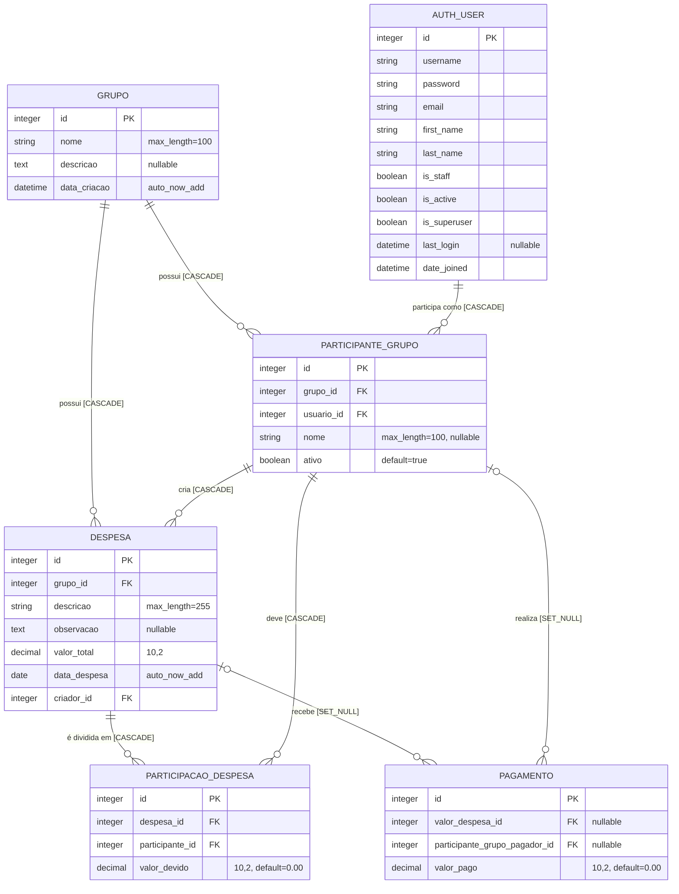

# Diagrama Entidade-Relacionamento

Este diagrama representa as models atualmente declaradas em `app_divide/models`.
Os campos `id` são chaves primárias criadas implicitamente pelo Django.

## Leitura do modelo

- `ParticipanteGrupo` materializa a associação entre um usuário e um grupo e identifica o criador de cada despesa.
- `Despesa` não possui mais relacionamento direto com `AUTH_USER`; seu campo `criador` referencia `ParticipanteGrupo`.
- `ParticipacaoDespesa` materializa a divisão de uma despesa entre os participantes, registrando o valor devido por cada um.
- `Pagamento` referencia opcionalmente uma despesa e o participante pagador; se um deles for excluído, a respectiva chave estrangeira passa a `NULL`.
- As demais chaves estrangeiras usam exclusão em cascata.

## Observações

- `AUTH_USER` corresponde à model configurada em `settings.AUTH_USER_MODEL`. Na configuração atual, é a model padrão `django.contrib.auth.models.User` (tabela `auth_user`).
- As models não declaram restrições `UniqueConstraint`. Assim, no estado atual, o banco permite repetir a associação usuário/grupo e a associação participante/despesa.
- Os nomes físicos padrão das tabelas são `app_divide_grupo`, `app_divide_despesa`, `app_divide_participantegrupo`, `app_divide_participacaodespesa` e `app_divide_pagamento`.
